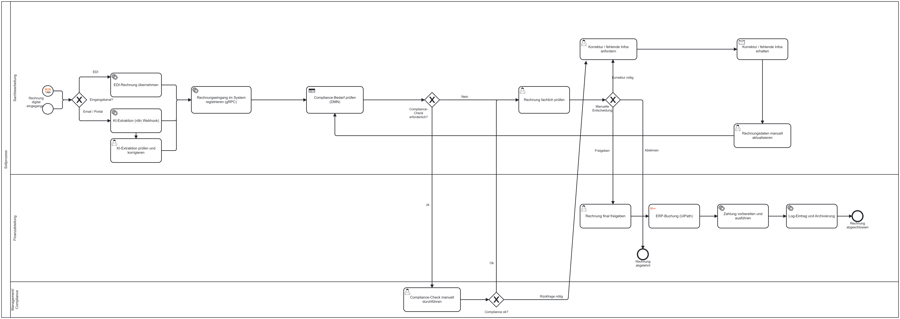
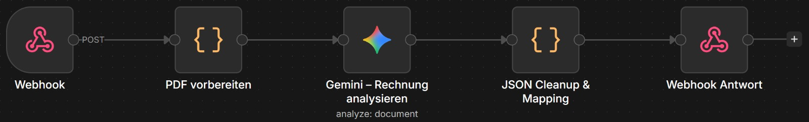

# Zusammenfassung unseres automatisierten Prozesses

## Sprint 1 (gRPC-Service)

### Architektur

Im ersten Sprint haben wir das technische Fundament des Systems gelegt, indem wir eine robuste Python-Backend-Architektur für die Validierung, Speicherung und Verarbeitung von Rechnungsdaten entwickelt haben. Über eine zentrale gRPC-Schnittstelle wurden die Datenstrukturen und CRUD-Operationen, mithilfe der .proto Dateien, definiert, die der gRPC-Server mittels einer CSR-Logik verarbeitet. Die dauerhafte Speicherung der Rechnungen und Positionen erfolgt über einen Connection-Pool in einer containerisierten PostgreSQL-Datenbank, die beim Start automatisch über SQL-Skripte initialisiert wird. Zur asynchronen Zahlungsabwicklung haben wir einen RabbitMQ-Broker aufgesetzt. Ein eigenständiger Payment-Worker konsumiert die Aufträge aus der Warteschlange und simuliert die Verarbeitung. Ein lokaler gRPC-Test-Client prüft die gesamte Pipeline, indem er den Prozessablauf mit einem Beispieldatensatz simuliert. Die gesamte Infrastruktur wird flexibel über Docker Compose verwaltet.

```text
 +-----------------------------------------------------------+
 |                       Test-Umgebung                       |
 |                                                           |
 |                   [ gRPC-Test-Client ]                    |
 |                       (client.py)                         |
 +--------------------+--------------+----------------------+
                      |              |
         gRPC Request |              | Zahlungsauftrag
                      v              v
 +--------------------+---+   +------+----------------------+
 |       gRPC-Server      |   |     [ RabbitMQ Broker ]      |
 |                        |   +--------------+--------------+
 | [ Router (router.py) ] |                  |
 |            |           |                  | Nachricht
 |            v (Daten)   |                  v
 | [ Logic (logic.py) ]   |   +--------------+--------------+
 |            |           |   |      [ Payment-Worker ]     |
 |            v (Sichern) |   |     (payment_system.py)     |
 | [ Repo (repository.py) ]   +-----------------------------+
 +------------+-----------+
              |
          SQL |
              v
 +------------+-----------+
 | [ PostgreSQL Datenbank ]|
 +------------------------+
```

## Sprint 2 (Celonis Analyse) [Stand: Sprint 2]

[Celonis View](https://academic-celonis-77a7bl.eu-2.celonis.cloud/package-manager/ui/views/ui/spaces/00e65bd7-239e-4569-a6d6-9e3a9f163eae/packages/d88f11d8-3fe2-4f2a-9624-ff994069fd91/nodes/8198d3c2-0b33-496e-a266-cc68b7c07ee4?activeTabs=cbee2346_55aa_4993_bdb7_f9f3267a82bc-view:566f741f-c453-4d84-a601-8f8ab6788a3e&share=efcfd7f5-ab91-4017-a3af-980aa3596c6f&bookmark=false)

Im zweiten Sprint haben wir uns intensiv mit Process Mining beschäftigt und den gesamten P2P - Prozess in Celonis genau untersucht. Bei der Analyse von 1500 realen Fällen ist aufgefallen, dass der optimale Standardablauf (Happy Path) gerade einmal 37 % der Gesamtprozesse ausmacht, während sich der Rest auf 24 verschiedene Prozessvarianten verteilt. Als Engpässe stellten sich vor allem die vielen manuellen Zwischenschritte heraus. So liegen Rechnungen nach der Freigabe oft zwei Tage herum, nur weil sie händisch in das ERP-System eingetippt werden müssen. Auch die Rechnungsmitteilung per E-Mail dauert rund 85 Stunden, gefolgt von Compliance-Prüfungen und Korrekturschleifen. Das kostet uns nicht nur Zeit, sondern, wegen verpasster Skonto-Fristen, auch Geld. Unser Vorschlag wäre eine Digitalisierung und Automatisierung des Prozesses. Durch den gezielten Umstieg auf digitale Lieferantenportale, automatisierte Compliance-Vorprüfungen und eine API-Anbindung, die Buchungen direkt anstößt, wollen wir den Prozess spürbar beschleunigen und fehlerfreier machen.

## Sprint 3 (BPMN Prozessmodell)

Basierend auf den in Sprint 2 identifizierten Bottlenecks, unter anderem die    48h Verzögerung bei der ERP-Buchung, die 7h bei der Compliance-Prüfung und die 11h bei uneinheitlichen Eingangskanälen, haben wir uns überlegt, wie ein effizienterer Soll-Prozess aussehen könnte. Modelliert haben wir diesen mit Camunda in BPMN. Konkret haben wir für die Compliance-Prüfung eine DMN-Entscheidungstabelle vorgesehen und für die unterschiedlichen Eingangskanäle (Portal, EDI) ein Message Start Event eingeplant. Die ERP-Buchung haben wir bewusst als manuellen User Task belassen, da laut Prof-Feedback die Automatisierung dieses Schritts erst in einem späteren Sprint erfolgen sollte. Parallel dazu haben wir eine Systemarchitektur entworfen, die die Workflow-Engine (Camunda/Zeebe) sowie die bereits in Sprint 1 gebauten Services (gRPC, RabbitMQ als Message Broker) als eigenständige Komponenten mit ihren Verbindungen zeigt.



## Sprint 4 (Camunda Workflow)

In diesem Sprint haben wir den digitalen Freigabeprozess als lauffähigen Workflow umgesetzt und dabei die Ergebnisse aus Sprint 1 und Sprint 3 zusammengeführt. Der Prozess kann per E-Mail gestartet werden (Message Start Event mit IMAP-Anbindung), zum Testen haben wir ihn aber meist per PowerShell-Skript gestartet, das die nötigen Prozessvariablen an Camunda übergibt. Die Metadaten zu einer Rechnung werden manuell extrahiert und anschließend über unseren in Sprint 1 gebauten gRPC-Service gespeichert. Die Eingabe der Rechnungsdaten ins ERP-System erfolgt manuell über eine UI (User Task, per Camunda Forms eingebunden). Für die Zahlung haben wir einen Service Task gebaut, der den Zahlungsauftrag über RabbitMQ an einen Payment Worker weitergibt, welcher die Zahlung dann verarbeitet.

## Sprint 5 (RPA Bot) [UiPath]

In diesem Sprint haben wir den letzten manuellen Schritt im Prozess automatisiert, und zwar die Eingabe der Rechnungsdaten ins ERP-System. Dafür haben wir einen RPA-Bot mit UiPath gebaut, der über den UiPath Outbound Connector direkt an unseren Camunda-Workflow angebunden ist. Der Bot öffnet automatisch den Browser mit dem ERP-Webformular und füllt alle Felder selbstständig aus, basierend auf den zuvor über gRPC gespeicherten Rechnungsdaten. Das spart Zeit und vermeidet Tippfehler, die bei der manuellen, immer gleich ablaufenden Dateneingabe passieren können.

## Sprint 6 (AI Agent) [n8n]

Im letzten Sprint haben wir auch den Prozessstart automatisiert: Statt den Prozess manuell zu starten, übernimmt das jetzt der Camunda E-Mail-Inbound Connector, der eingehende Rechnungen per E-Mail entgegennimmt und den Prozess auslöst. Ein Python-Worker (ai-extract-invoice) holt den PDF-Anhang über die Camunda Document API und schickt ihn an einen n8n-Webhook-Workflow weiter. Dort extrahiert Google Gemini AI die relevanten Rechnungsdaten (Rechnungsnummer, Betrag, IBAN, Positionen) und gibt sie als strukturiertes JSON zurück an den Camunda-Prozess. Ein Mitarbeiter kontrolliert das Ergebnis und aktualisiert die Daten bei Bedarf, bevor geprüft wird, ob ein Compliance-Check nötig ist. Ist die Rechnung in Ordnung, greift der UiPath-Bot aus Sprint 5 und überträgt die Daten automatisch ins ERP-System, bevor die Zahlung ausgelöst und die Rechnung archiviert wird.



## Bewertung des Projekts

### Eigene Bewertung des Projekts

Im Rahmen unseres Projekts zur Digitalisierung eines Geschäftsprozesses haben wir den **Purchase-to-Pay**-Ablauf vom Rechnungseingang bis zur Archivierung erfolgreich automatisiert. Besonders spannend war für uns dabei der Weg von der Theorie in die Praxis, denn wir haben nicht einfach nur drauflos entwickelt, sondern mit einer fundierten **Prozessanalyse via Celonis** gestartet. Durch die Untersuchung von **1.500 Fällen** konnten wir echte Engpässe wie manuelle ERP-Eingaben identifizieren und diese dann gezielt angehen. Technisch war die Umsetzung über die sechs Sprints hinweg außerordentlich lehrreich. Wir haben eine Architektur geschaffen, die **synchrone gRPC-Kommunikation** mit asynchronen Prozessen über **RabbitMQ** verbindet und zudem moderne Technologien wie **n8n** und **Google Gemini** zur **KI-gestützten** Datenextraktion einbindet.

Natürlich gab es auch Momente, in denen wir an Grenzen gestoßen sind. Rückblickend war die größte Herausforderung nicht das Programmieren einzelner Funktionen, sondern das **Zusammenspiel der verschiedenen Systeme**. Die Synchronisation zwischen dem **Camunda Web Modeler** und unserem Repository sowie die Verwaltung der zahlreichen Schnittstellen erforderte von uns allen extrem viel Disziplin. Das hat uns klar vor Augen geführt, wie wichtig professionelle **CI/CD-Prozesse** in der echten Arbeitswelt sind. Auch die Abhängigkeit von verschiedenen Cloud-Diensten hat uns im Team gezwungen, über Fehlertoleranz und Sicherheitsstrategien nachzudenken, die weit über das hinausgehen, was man normalerweise in einem rein studentischen Umfeld macht.

### Mehrwert unserer Sprints

Um den Erfolg des Projekts zu begründen, lässt sich der Nutzen der entwickelten Architektur an konkreten Prozessverbesserungen festmachen:

* **Drastische Verkürzung der Durchlaufzeit (DLZ) bei der ERP-Buchung (UiPath RPA-Bot):**
  * *Problem:* Rechnungsdaten mussten manuell abgetippt werden, was zu Liegezeiten von durchschnittlich 48 Stunden und häufigen Tippfehlern führte.
  * *Mehrwert:* Der UiPath-Bot liest die Daten direkt aus unserem gRPC-Backend und trägt sie in Sekunden fehlerfrei in das ERP-System ein. Dadurch wurde dieser Flaschenhals vollständig eliminiert.
* **Beschleunigter Prozessstart ohne Medienbrüche (n8n & Gemini AI Agent):**
  * *Problem:* Der manuelle Start und das manuelle Auslesen von PDF-Rechnungen kostete wertvolle Zeit.
  * *Mehrwert:* Eingehende E-Mails starten den Workflow nun sofort. Die KI-gestützte Datenextraktion (n8n + Gemini) erfasst alle Rechnungsmetadaten und Positionen direkt aus dem PDF. Mitarbeiter müssen die Daten nur noch kurz kontrollieren, statt sie mühsam abzutippen.
* **Effiziente Dunkelverarbeitung im Compliance-Check (DMN-Entscheidungstabelle):**
  * *Problem:* Jede Rechnung musste zeitaufwendig manuell auf Compliance-Vorgaben geprüft werden (durchschnittlich 7 Stunden Verzögerung).
  * *Mehrwert:* Standardfälle unterhalb der definierten Schwellenwerte (z. B. unter 10.000 EUR) werden durch die DMN-Tabelle automatisch freigegeben. Nur noch Risiko-Rechnungen erfordern einen manuellen Eingriff, was die Compliance-Abteilung massiv entlastet.
* **Ausfallsichere und transparente Ende-zu-Ende-Steuerung (Camunda 8 & RabbitMQ):**
  * *Problem:* Isolierte Arbeitsschritte führten zu Liegezeiten an den Abteilungsübergängen und intransparenten Status.
  * *Mehrwert:* Camunda 8 steuert den gesamten Prozess zentral und bietet einen lückenlosen Audit-Trail. Die Anbindung unseres gRPC-Speichers und die asynchrone Zahlungsabwicklung über RabbitMQ stellen zudem sicher, dass Rechnungsdaten sicher abgelegt und Zahlungen selbst bei hoher Last zuverlässig und ohne Systemabstürze ausgeführt werden.
